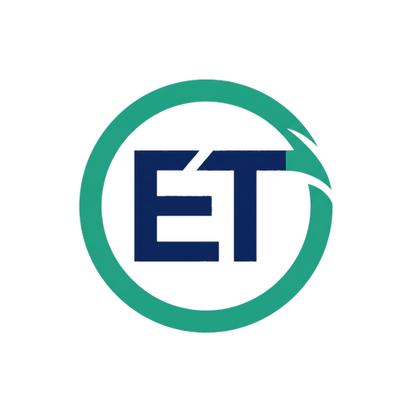
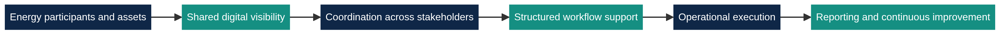
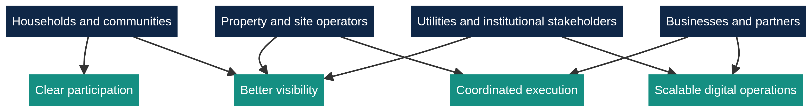

  
  
  

  

# Energie Teilen

**Energie Teilen** builds software and digital infrastructure for coordinated participation, visibility, and execution in distributed energy environments.

We create the digital layer that helps people, assets, and institutions work together more clearly across modern energy settings. Our public profile is designed to explain **what we do**, who it is for, and what value it creates, while keeping proprietary implementation details private.

## Table of Contents

1. [Overview](#overview)
2. [What we do](#what-we-do)
3. [What this creates in practice](#what-this-creates-in-practice)
4. [Who this is for](#who-this-is-for)
5. [Public operating view](#public-operating-view)
6. [Stakeholder value view](#stakeholder-value-view)
7. [Public repository structure](#public-repository-structure)
8. [Licensing](#licensing)
9. [Based in](#based-in)
10. [Further reading](#further-reading)
11. [References](#references)

## Overview

Across Europe, energy systems are becoming more decentralised, more digital, and more participatory. Public institutions and industry bodies increasingly describe energy communities, citizen participation, and digital coordination as important parts of the transition toward more flexible and resilient energy systems [1] [2].

Energie Teilen operates in that environment. We build software and infrastructure that support coordinated participation in energy-related workflows, improve visibility across stakeholders, and make distributed operational activity easier to understand and manage.

## What we do

At a public level, Energie Teilen provides a digital operating surface for energy participation and coordination.

That means we focus on the software layer that helps different participants work through a shared process with better clarity. We support the flow from fragmented information toward structured visibility, coordinated activity, and accountable execution.

Our public scope includes the following functions.

| Public function | What it means |
|---|---|
| **Participation infrastructure** | We support structured participation across distributed energy-related environments. |
| **Shared visibility** | We make operational information easier to see, understand, and act on. |
| **Stakeholder coordination** | We support workflows that involve multiple participants, roles, and responsibilities. |
| **Workflow support** | We turn scattered tasks into clearer digital processes. |
| **Reporting surface** | We help create a more usable operational record for ongoing improvement and governance. |

This description is intentionally public-facing. It explains the service category and the value surface without disclosing specific commercial logic, internal system methods, or proprietary execution design.

## What this creates in practice

The value of the platform is practical rather than abstract. In distributed energy settings, fragmentation is expensive in time, communication, and operational certainty. Public research and policy materials consistently point to the importance of clearer participation, digital coordination, and improved matching of distributed supply and demand [1] [2].

Energie Teilen is positioned to address exactly that class of problem. The result is a cleaner digital experience for coordination, a stronger operational view across stakeholders, and a more scalable basis for running energy-related activity.

## Who this is for

Energie Teilen is designed for environments where energy activity is distributed across multiple actors rather than controlled by a single isolated operator.

| Stakeholder group | Public relevance |
|---|---|
| **Households and local communities** | Better participation and a clearer digital interface for local energy activity. |
| **Property and site operators** | Better visibility across assets, roles, and recurring operational tasks. |
| **Businesses and delivery partners** | A more structured environment for coordination and execution. |
| **Utilities and institutional stakeholders** | A cleaner digital layer for oversight, reporting, and scalable participation. |

## Public operating view

The diagram below shows the public operating surface of Energie Teilen. It describes the visible problem space and the value chain we address, without disclosing internal methods.

The model is straightforward. Distributed participants and assets create a complex operating environment. Energie Teilen focuses on the digital layer that improves visibility, supports coordination, enables structured workflow execution, and strengthens reporting over time.

## Stakeholder value view

The platform is designed to create value across multiple stakeholder groups rather than only one isolated user type.

This view is important because the energy transition increasingly depends on systems that can support many participants at once, including citizens, local communities, businesses, and institutional actors [1]. At the same time, electricity systems increasingly rely on digital tools to improve efficiency, integrate distributed resources, and better align supply with demand [2].

## Public repository structure

This public profile repository exists to present the organization clearly while separating public communication from private product development.

| Public layer | Purpose |
|---|---|
| **`.github/profile/README.md`** | Public-facing organization overview |
| **`profile/assets/`** | Images used by the public README |
| **Private repositories** | Product code, internal services, commercial workflows, and protected implementation |

If you are viewing this organization publicly, you are seeing the front door rather than the full internal product surface.

## Licensing

This public `.github` repository is aligned with **Apache License 2.0**. That license applies to the public profile repository and its published assets unless stated otherwise.

> **Important:** the Apache-2.0 license on this public repository does **not** grant public rights to any separate private repositories, commercial code, or proprietary internal systems owned and operated by Energie Teilen.

## Based in

**Frankfurt am Main, Germany**

## Further reading

If you want broader context for the public problem space Energie Teilen operates in, the following official resources are useful.

| Topic | Resource |
|---|---|
| **Energy communities in Europe** | [European Commission: Energy communities][1] |
| **Digitalisation in electricity systems** | [International Energy Agency: Digitalisation][2] |
| **Apache-2.0 license text** | [Open Source Initiative: Apache License 2.0][3] |

## References

[1]: https://energy.ec.europa.eu/topics/markets-and-consumers/energy-consumers-and-prosumers/energy-communities_en "European Commission - Energy communities"
[2]: https://www.iea.org/energy-system/electricity/digitalisation "International Energy Agency - Digitalisation"
[3]: https://opensource.org/license/apache-2-0 "Open Source Initiative - Apache License 2.0"
