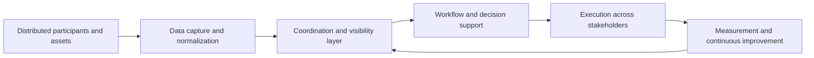

<p align="center">
  
  
  <a href="https://opensource.org/license/apache-2-0"></a>
</p>

# Energie Teilen

**Energie Teilen** builds software and infrastructure for coordinated energy participation, operational visibility, and scalable digital execution.

We are building a disciplined technology surface for environments where energy, people, assets, and decisions need to work together more clearly. This public profile is intentionally precise but selective. It explains the operating logic, the engineering philosophy, and the direction of the organization without disclosing proprietary implementation details or market-specific execution playbooks.

## Table of Contents

1. [Overview](#overview)
2. [Why this exists](#why-this-exists)
3. [What we build](#what-we-build)
4. [System view](#system-view)
5. [Operating principles](#operating-principles)
6. [Repository structure](#repository-structure)
7. [Current focus](#current-focus)
8. [Licensing approach](#licensing-approach)
9. [Based in](#based-in)
10. [Contact and collaboration](#contact-and-collaboration)

## Overview

Energie Teilen exists to reduce friction in complex energy-related workflows by turning fragmented information, disconnected participants, and operational uncertainty into structured digital coordination.

Our approach is practical. We care about systems that are understandable, deployable, and resilient in the real world. The goal is not to add another layer of noise. The goal is to create software that makes participation, execution, and oversight substantially clearer.

## Why this exists

Many energy workflows still suffer from the same structural problems. Information is fragmented. Responsibilities are distributed across actors who do not share the same systems. Execution depends on manual coordination. Visibility often arrives too late to be useful.

Energie Teilen is being built to address that pattern. We focus on the digital layer that helps multiple parties move from scattered inputs to coordinated action.

## What we build

At a high level, Energie Teilen focuses on the software and infrastructure layer that connects stakeholders, standardizes data and process inputs, supports decision-ready views, and enables repeatable operational workflows.

The public description remains intentionally high level. That is deliberate. We want the organization profile to be clear, credible, and useful without exposing the exact strategic edge.

## System view

The platform logic can be understood through the following system view.



This diagram describes the operating shape of the system. It explains how the solution thinks while keeping sensitive implementation details private.

## Operating principles

The organization is being built around a small number of principles that matter in real deployment settings.

| Principle | Meaning |
|---|---|
| **Clarity over noise** | Information should become more usable as it moves through the system. |
| **Coordination over fragmentation** | Software should make multi-party execution easier, not more confusing. |
| **Operational realism** | The product must work in conditions that are imperfect, distributed, and time-sensitive. |
| **Scalable structure** | The architecture should support growth in users, workflows, and institutional complexity. |
| **Protected differentiation** | Public communication should be informative without giving away the strategic core. |

## Repository structure

The organization will be managed with a clean separation between public presence, private product work, and deployment environments.

| Layer | Purpose |
|---|---|
| **Organization profile** | Public-facing overview and trust layer |
| **Private repositories** | Core product code, internal tooling, and strategic experiments |
| **Deployment environments** | Controlled release paths for applications, services, and infrastructure |
| **Cloud accounts** | Operational isolation, security, and future scaling readiness |

## Current focus

Energie Teilen is currently in an active build phase. The public profile is intentionally compact while the foundations are being put in place with long-term structure in mind.

That means the most important work is happening in architecture, system design, repository discipline, and deployment readiness. Public materials will expand as the product surface matures.

## Licensing approach

For this **public `.github` profile repository**, the most professional default choice is **Apache License 2.0** because it is widely recognized, business-friendly, and clearer than a casual placeholder license for public documentation and profile assets.

At the same time, that public repository license should **not** be confused with the licensing position of private product repositories. Unless you intentionally open-source a specific repository, the core product, internal workflows, and proprietary implementation should remain private and unlicensed to the public.

> **Important:** a license attached to the public `.github` repository does not open or transfer rights to your private commercial codebase.

## Based in

**Frankfurt am Main, Germany**

## Contact and collaboration

This organization is being built with a long-term operating model in mind. Collaboration, partnerships, and public technical materials will expand over time as the platform surface becomes ready for broader engagement.

For now, this profile serves as the public front door for the organization.

---

## Recommended repository description

Use this exact repository or organization description where needed:

> **Software and infrastructure for Energie Teilen.**

---

## Recommended license file for the `.github` repository

If you add a license to the public `.github` repository, use **Apache-2.0**.

If GitHub asks which license to choose, select:

> **Apache License 2.0**

---

## Future CI badge

Do **not** add a fake CI badge yet. The most professional move is to add a workflow badge only after a real public workflow exists in the repository. If you later create a workflow called `profile-checks.yml` inside `energie-teilen/.github`, you can then add a real badge in this format:

```html
<a href="https://github.com/energie-teilen/.github/actions/workflows/profile-checks.yml"></a>
```
